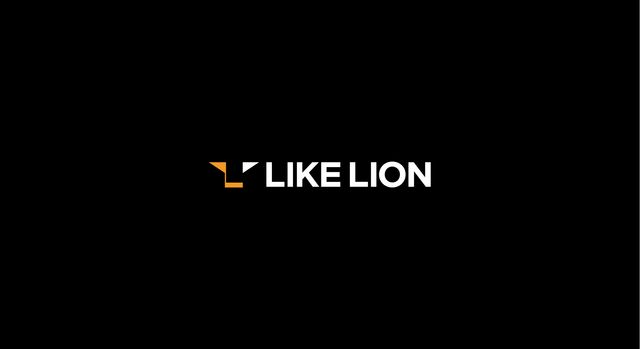

<!-- 회고 -->

# 멋쟁이 사자처럼 프론트엔드 13기 부트캠프 5주차 회고



#### 작성자: 김태우

<hr>

### 과제 회고

#### 요약

이번 과제는 전 과제에 비해 한 단계 더 실무에 가까운 느낌이 들었습니다. 전 과제는 로그인 화면을 구현하여 웹사이트 프로세스의 일부를 구현하는 법을 체험했다면, 이번 과제는 홈페이지의 프로모션 파트를 구현하고, 이번 주에 배웠던 그리드를 적극 활용하여 현업자들의 코드를 클론해보는 (물론 애플 실제 홈페이지를 보면서, 현업자들의 실제 코드는 더 복잡하다는 것을 재차 느꼈습니다) 좋은 기회라고 생각합니다. <br>
아래 내용은 이번 과제를 수행하면서 겪은 이슈 정리입니다.

#### 이슈 1 - 카드 레이아웃 width 구현


에러화면을 보면, 구현 영상과 달리 이미지가 vw에 따라 제대로 넓히지 않는 것을 볼 수 있습니다. 해당 오류가 생긴 핵심 코드는 아래와 같습니다.

```css
/* 카드 레이아웃 */

.card-wrapper {
  background: green;
  background-size: 100vw auto;
  background-repeat: no-repeat;
  background-position: center;
}

.container-ipad-pro {
  display: flex;
  flex-direction: column;
  align-items: center;
  background-color: var(--black);
  min-width: 320px;
}

.ipad-pro {
  background-image: url("../products/ipad_pro.jpeg");

  @media (min-width: 1024px) {
    background-size: cover;
    background-image: url("../products/ipad_pro_wide.jpeg");
  }
}
```

혼자 연구하다가 해결책을 못 찾아서 박선영 수강생에게 도움을 요청했습니다. 문제는 상위 요소 '.card-wrapper'의 width를 100%로 설정하지 않아서 였고, 수정 후 정상 구현이 되었습니다. 이 자리를 빌어 박선영 수강생에게 감사하다는 말을 하고 싶습니다.


해당 이슈로 저는 제가 이런 기본적인 개념적인 부분이 부족하다는 것을 알게 되었고, 특히 flex의 구현 방법을
이번 과제를 계기로 더 연습할 수 있어서 좋았습니다.

```css
{
display: flex;
flex-direction: column;
/* ... */
}
```

(과거 혼자 공부할 땐, flex-direction의 의미를 몰라서
구현에 애를 먹었던 경험이 많았습니다. 그래서 이번 과제가 더 인상 깊었습니다.)

#### 이슈 2 - 버튼 구현 오류

과제 시연 영상을 보고 컴포넌트를 구현하면서, '더 알아보기' '가격 보기' 컴포넌트는 당연히 'button'태그로 구현해야 겠다는 생각으로 구현했고, 과제 풀이 중간쯤이 되서야 이상한 부분을 느꼈습니다.<br>
'a'태그 안에 'button'을 감싸서 구현했는데, 커서를 'button'위치로 이동한 경우, 커서의 변화가 없는 게 문제였습니다.<br>
분석하고 원인은 찾아본 결과, 이건 당연히 생기는 문법 오류였고, 원하는 대로 커서 변환을 구현하려면, 'a'를 CSS를 통해 버튼의 형태로 구성하는 것이 정석적인 방법이었습니다.<br>
해당 이슈를 계기로 다시끔 잊었던 문법의 기본을 상기할 수 있어서 좋았고, 덕분에 앞으로 같은 실수를 범할 일은 없을 거 같습니다.

<br>
과제를 마무리하면서 실력을 향상 시키기 위해 기본기는 가장 중요하다는 것을 다시 깨달았고, 앞으로 꾸준히 공식 자료를 찾아보면서 기본 개념을 숙지해야겠습니다. 마지막으로 다크테마를 index페이지, apple과제 favicon, 배경으로 적용하여 연습할 수 있었고, 이 부분도 향후 자주 활용할 수 있을 거 같아서 좋았습니다.

### 주간 회고

멋사 부트캠프 오고나서 가장 좋은 점은 시간이 빨리 가는 거 였습니다. 하지만 가장 안 좋은 점 또한 시간이 빨리 가는 거라고 생각합니다. <br>
전에 혼자 인강보면서 따라하고 공부할 땐, 오로지 ai나 구글링에 의지하여 공부했고, 어느 정도 궁금증이 해소가 됐지만 이해가 안 가는 부분이 많았습니다.<br>
부트캠프는 달랐습니다. 매일 강사님과 같이 개념 학습하고 실습하고, 끝나고 회고하고, 다시 정리하고 과제를 하면서, 같은 한 시간을 공부해도 혼자 하는 것보다 더 효과적으로 학습이 되고, 과거 한 두 달의 저와 비교한다면 진짜 장족의 발전이 있었다는 생각이 들었습니다. 왜냐면 그 전에는 따라치는 것만 빨랐지, 과제 페이지를 보면서 머리 속에 구상하고 구현하는 능력이 거의 없었기 때문입니다.<br>
물론 과거 제 공부 방식이 잘 못 됐을 수 있지만, 그래도 지금이라도 다시 확실히 배울 수 있다는 것이 좋았고, 남은 시간 동안 더 발전하고 싶다는 욕심이 생겼습니다.<br>
지금 이 마음을 잊지 않고, 남은 시간도 적극 활용하여, 반드시 개발자가 되겠다는 다짐을 하면서, 이번 회고를 마무리하겠습니다. 슬비쌤 앞으로도 잘 부탁드립니다. 감사합니다!
